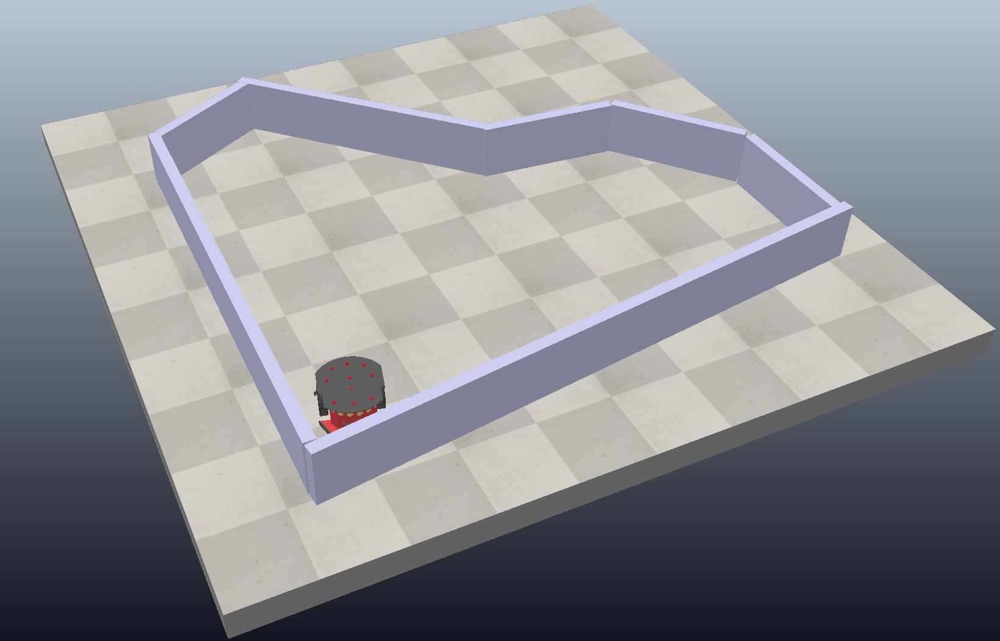
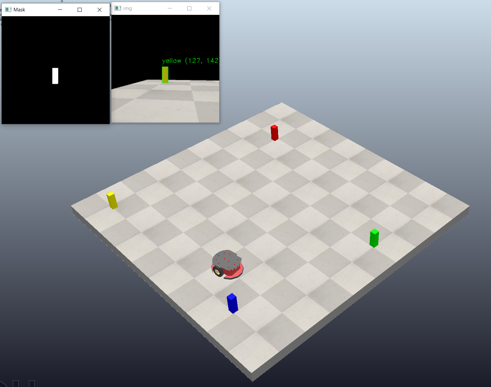
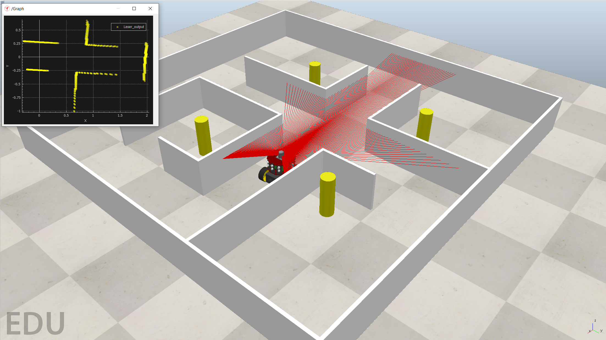

# Coppeliasim Robot Simulation Project with ZMQ Remote API

This project contains various robot simulation demos using CoppeliaSim and Python. The project is organized into several directories, each demonstrating different functionalities and algorithms for robot control and sensor integration.

## Getting Started

### Prerequisites

- [CoppeliaSim](https://www.coppeliarobotics.com/)
- Python 3.x
- Required Python packages: `numpy`, `opencv-python`, `zmq`

### Installation

1. Clone the repository:
    ```sh
    git clone https://github.com/yudarw/coppeliasim-projects-with-zmqRemoteApi.git
    ```

2. Install the required Python packages:
    ```sh
    python -m pip install coppeliasim-zmqremoteapi-client
    ```
## Materials
### 1_getting started
Contains the initial setup and basic demo for the Pioneer P3DX mobile robot.
### 2_read_ultrasonic_sensor
Demonstrates how to read data from ultrasonic sensors on the Pioneer P3DX robot.
### 3_wall_follower_robot
Implements a wall-following algorithm using the Pioneer P3DX robot and its ultrasonic sensors.

### 4_vision_sensor
Shows how to read data from a vision sensor and apply HSV filtering.
### 5_object_tracking
Contains scripts for object tracking using color filtering and contour detection.

### 6_UR10
Includes demos for controlling the UR10 robot using inverse kinematics and other functionalities.
### 9_Fire Fighting Robot Simulation

## Acknowledgments
- [CoppeliaSim](https://www.coppeliarobotics.com/)
- [OpenCV](https://opencv.org)
